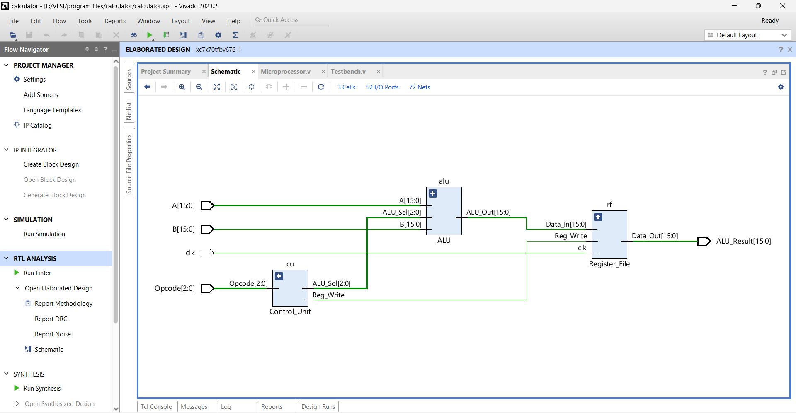
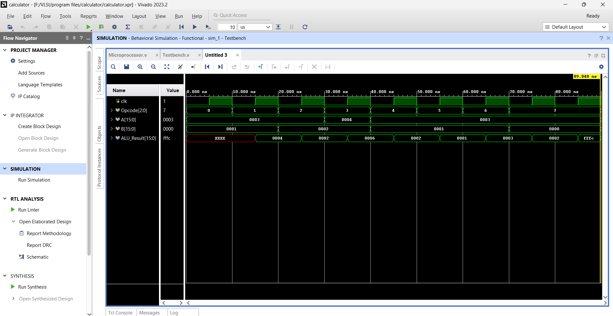

# 16-Bit Calculator Microprocessor

## Project Overview

Hi! I'm excited to share my project, the **16-Bit Calculator Microprocessor**. This project is a hands-on exploration into the world of microprocessors. I designed and implemented a simple 16-bit calculator, which demonstrates how basic arithmetic and logic operations are performed in hardware. This project was a fantastic opportunity to dive into microprocessor architecture and see how various components work together to execute tasks.

### Purpose

The main goal of this project was to create a basic microprocessor that can handle fundamental operations such as addition, subtraction, multiplication, division, and bitwise operations. By using hardware description language (HDL), I aimed to understand the inner workings of a microprocessor and how these operations are processed at the hardware level. This project was an educational tool that bridged the gap between theoretical concepts and practical hardware design.

### Project Components

- **ALU (Arithmetic Logic Unit)**: This is the heart of the microprocessor where all the arithmetic and logic operations take place based on the operation code (opcode).
- **Control Unit**: It decodes the opcode and selects the appropriate operation for the ALU while managing how results are written to the registers.
- **Register File**: This stores the results of operations and provides data to the ALU as needed.

### Features

- **Arithmetic Operations**: Addition, Subtraction, Multiplication, Division (16-bit)
- **Logic Operations**: AND, OR, XOR, NOT (16-bit)
- **Simple Microprocessor Architecture**: Combines an ALU, Control Unit, and Register File for a functional 16-bit calculator

## Schematic and Simulation

### Schematic

Here’s the schematic diagram of my microprocessor design:

*Figure 1: Schematic Diagram of the 16-Bit Calculator Microprocessor*

### Simulation

Below is the simulation output showing how the microprocessor performs different operations:

*Figure 2: Simulation Output of the 16-Bit Calculator Microprocessor*

## Installation and Setup

To get started with this project, you’ll need Xilinx Vivado. Here’s how you can set up and run the project:

1. **Open Vivado**:
   Launch Vivado and create a new project.

2. **Add Sources**:
   Include the Verilog source files:
   - `ALU.v`
   - `Control_Unit.v`
   - `Register_File.v`
   - `Microprocessor.v`

3. **Add Constraints** (if needed):
   Add any constraints required for your hardware setup, such as pin mappings.

4. **Compile the Design**:
   Run synthesis and implementation:
   - Go to the "Flow Navigator" and select "Run Synthesis".
   - After synthesis, select "Run Implementation".

5. **Run the Simulation**:
   Add the test bench file (`Testbench.v`) and run the simulation:
   - Go to the "Flow Navigator" and select "Run Simulation".
   - Choose "Run Behavioral Simulation" to view the results.

## Usage

With the simulation running, you can view the results of various operations in the simulation console or waveform viewer. The test bench applies different opcodes and operands to verify the functionality of the microprocessor. Feel free to modify the test cases or add new ones to explore different scenarios.

## Conclusion

Working on the **16-Bit Calculator Microprocessor** was a rewarding experience. It allowed me to gain a deeper understanding of microprocessor design and operations. By creating a hardware implementation of a calculator, I was able to see firsthand how microprocessors perform tasks and how various components interact. This project was a valuable learning opportunity and helped me connect theoretical knowledge with practical hardware design.
